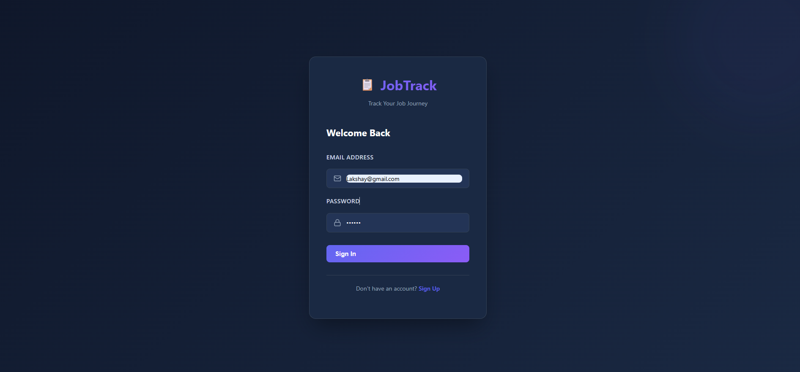
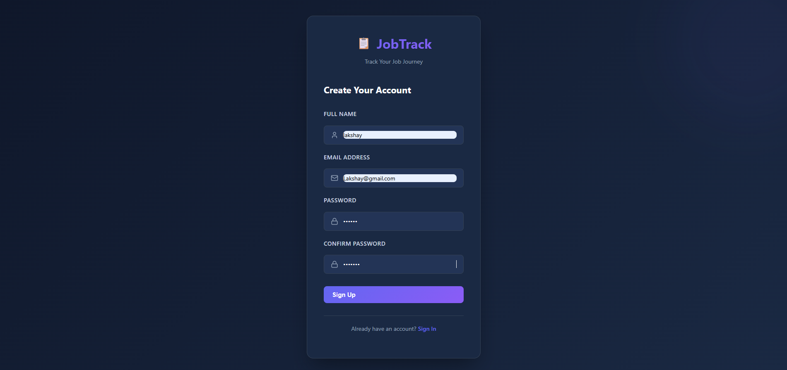
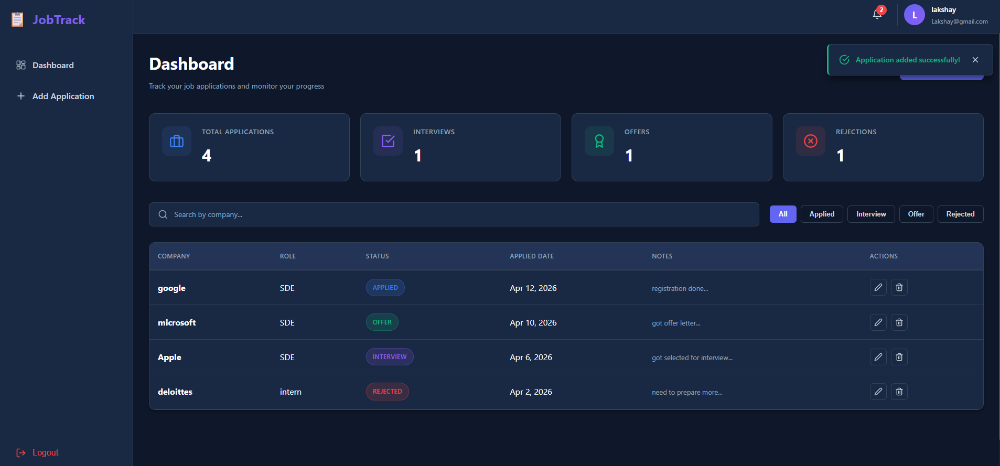

# Job Application Tracker System 📋

A complete, production-ready **Full-Stack Job Application Tracker** with a modern dark-theme UI and professional architecture.

---

## 🎯 Features

✅ **User Authentication** - Secure JWT-based login/registration with BCrypt password hashing
✅ **Dashboard** - Beautiful stats cards showing applications overview
✅ **CRUD Operations** - Create, read, update, delete job applications
✅ **Search & Filter** - Search by company, filter by status
✅ **Responsive Design** - Works seamlessly on desktop, tablet, and mobile
✅ **Dark Theme** - Modern, professional UI with glassmorphism effects
✅ **Real-time Stats** - Live dashboard statistics
✅ **Data Validation** - Comprehensive input validation on both frontend and backend

## LOGIN

## SIGNUP

## DASHBOARD

---

## 🏗️ Architecture

### **Frontend:**
- React 18 with Functional Components and Hooks
- React Router v6 for routing
- Axios for HTTP requests
- Context API for state management
- Pure CSS with dark theme design

### **Backend:**
- Spring Boot 3.2 (Java 17)
- MySQL Database
- JWT Authentication
- Clean Layered Architecture (Controller → Service → Repository)
- RESTful API design

### **Database:**
- MySQL with optimized schema
- Foreign keys and indexes for performance
- Automatic timestamp tracking

---

## 📁 Project Structure

```
job application tracker/
├── backend/
│   ├── src/main/java/com/jobtracker/
│   │   ├── JobApplicationTrackerApplication.java
│   │   ├── controller/
│   │   │   ├── AuthController.java
│   │   │   └── ApplicationController.java
│   │   ├── service/
│   │   │   ├── AuthService.java
│   │   │   └── ApplicationService.java
│   │   ├── repository/
│   │   │   ├── UserRepository.java
│   │   │   └── ApplicationRepository.java
│   │   ├── entity/
│   │   │   ├── User.java
│   │   │   └── Application.java
│   │   ├── dto/
│   │   │   ├── RegisterRequest.java
│   │   │   ├── LoginRequest.java
│   │   │   ├── AuthResponse.java
│   │   │   ├── UserDTO.java
│   │   │   ├── ApplicationRequest.java
│   │   │   ├── ApplicationDTO.java
│   │   │   └── StatsDTO.java
│   │   └── security/
│   │       ├── JwtUtil.java
│   │       ├── JwtFilter.java
│   │       └── SecurityConfig.java
│   ├── src/main/resources/
│   │   └── application.properties
│   └── pom.xml
├── frontend/
│   ├── src/
│   │   ├── components/
│   │   │   ├── Sidebar.js & Sidebar.css
│   │   │   ├── Navbar.js & Navbar.css
│   │   │   ├── StatCard.js & StatCard.css
│   │   │   ├── ApplicationTable.js & ApplicationTable.css
│   │   │   ├── ApplicationForm.js & ApplicationForm.css
│   │   │   ├── AlertBanner.js & AlertBanner.css
│   │   │   └── ProtectedRoute.js
│   │   ├── pages/
│   │   │   ├── Login.js
│   │   │   ├── Register.js
│   │   │   ├── Dashboard.js & Dashboard.css
│   │   │   └── Auth.css
│   │   ├── services/
│   │   │   └── api.js
│   │   ├── context/
│   │   │   └── AuthContext.js
│   │   ├── styles/
│   │   │   └── global.css
│   │   ├── App.js & App.css
│   │   └── index.js
│   ├── public/
│   │   └── index.html
│   └── package.json
├── database_schema.sql
└── README.md
```

---

## 🚀 Setup Instructions

### **Prerequisites**
- Java 17+
- Node.js 16+
- MySQL 8.0+
- Maven 3.8+

### **Step 1: Database Setup**

1. Open MySQL and create the database:
```bash
mysql -u root -p
```

2. Run the database schema:
```bash
source database_schema.sql
```

Or copy-paste the SQL from `database_schema.sql` into MySQL Workbench.

**Demo User:**
- Email: `demo@example.com`
- Password: `password123`

---

### **Step 2: Backend Setup (Spring Boot)**

1. Navigate to backend folder:
```bash
cd backend
```

2. Update `application.properties`:
```properties
spring.datasource.url=jdbc:mysql://localhost:3306/job_tracker_db
spring.datasource.username=root
spring.datasource.password=<your_mysql_password>
jwt.secret=your-super-secret-key-change-this-in-production-at-least-256-bits-long
```

3. Build and run:
```bash
mvn clean install
mvn spring-boot:run
```

**Backend runs on:** `http://localhost:8080`

---

### **Step 3: Frontend Setup (React)**

1. Navigate to frontend folder:
```bash
cd frontend
```

2. Install dependencies:
```bash
npm install
```

3. Start development server:
```bash
npm start
```

**Frontend opens at:** `http://localhost:3000`

---

## 🔐 Authentication Flow

1. User registers/logs in
2. Backend validates credentials and generates JWT token
3. Token stored in localStorage
4. Token sent in Authorization header for protected routes
5. Backend validates token for each request
6. Expired token triggers re-login

---

## 📊 API Endpoints

### **Authentication**
| Method | Endpoint | Description |
|--------|----------|-------------|
| POST | `/auth/register` | Register new user |
| POST | `/auth/login` | Login user |

### **Applications**
| Method | Endpoint | Description |
|--------|----------|-------------|
| GET | `/applications` | Get all applications |
| GET | `/applications?status=INTERVIEW` | Get by status |
| GET | `/applications?company=Google` | Search by company |
| POST | `/applications` | Create application |
| PUT | `/applications/{id}` | Update application |
| DELETE | `/applications/{id}` | Delete application |
| GET | `/applications/stats` | Get dashboard stats |

---

## 🎨 Dark Theme Colors

```css
--bg-primary: #0f172a     /* Main background */
--bg-secondary: #1a2943   /* Cards background */
--bg-tertiary: #233456    /* Input background */
--text-primary: #ffffff   /* Main text */
--text-secondary: #cbd5e1 /* Secondary text */
--text-tertiary: #94a3b8  /* Tertiary text */
--accent-primary: #6366f1 /* Primary accent (Indigo) */
--accent-secondary: #8b5cf6 /* Secondary accent (Purple) */
--success: #10b981        /* Success state */
--error: #ef4444          /* Error state */
```

---

## 📱 Responsive Design

✅ **Desktop:** Full sidebar navigation + navbar
✅ **Tablet:** Collapsible sidebar + optimized layout
✅ **Mobile:** Bottom navigation simulation + card-based layout

---

## 🧪 Sample Data

Pre-loaded demo applications:
- Amazon – SDE-2 (APPLIED)
- Google – Senior Software Engineer (INTERVIEW)
- Microsoft – Software Engineer (REJECTED)
- Flipkart – Backend Engineer (OFFER)

---

## ⚠️ Error Handling

### Frontend:
- Form validation before submission
- API error messages displayed as alerts
- Unauthorized requests redirect to login
- Network errors handled gracefully

### Backend:
- Input validation with descriptive messages
- JWT validation on protected routes
- User authorization checks (users can only access their data)
- Proper HTTP status codes

---

## 🔑 Security Features

✅ **Password Hashing:** BCrypt with salt
✅ **JWT Tokens:** Secure token-based authentication
✅ **CORS Configured:** Only localhost:3000 allowed
✅ **Input Validation:** Both frontend and backend
✅ **Authorization Checks:** Users can only access their own data
✅ **SQL Injection Protection:** JPA parameterized queries

---

## 🐛 Troubleshooting

### Backend won't start:
```bash
# Check if port 8080 is in use
lsof -i :8080  # macOS/Linux
netstat -ano | findstr :8080  # Windows

# Check MySQL connection
mysql -u root -p -e "SELECT 1"
```

### Frontend can't connect to backend:
- Ensure backend is running on `http://localhost:8080`
- Check CORS configuration in SecurityConfig
- Clear browser cache and localStorage

### Database errors:
- Verify MySQL is running
- Check credentials in application.properties
- Ensure database `job_tracker_db` exists

---

## 📦 Deployment

### **Backend (Production):**
```bash
# Build JAR
mvn clean package

# Run JAR
java -jar target/job-application-tracker-1.0.0.jar
```

### **Frontend (Production):**
```bash
# Build optimized bundle
npm run build

# Deploy `build/` folder to hosting
```

---

## 📝 API Response Examples

### **Login Response:**
```json
{
  "token": "eyJhbGciOiJIUzUxMiJ9...",
  "message": "Login successful",
  "user": {
    "id": 1,
    "name": "Demo User",
    "email": "demo@example.com",
    "role": "USER"
  }
}
```

### **Get Applications Response:**
```json
[
  {
    "id": 1,
    "userId": 1,
    "company": "Amazon",
    "role": "SDE-2",
    "status": "APPLIED",
    "appliedDate": "2024-04-02",
    "notes": "Strong company, good learning opportunity"
  },
  {
    "id": 2,
    "userId": 1,
    "company": "Google",
    "role": "Senior Software Engineer",
    "status": "INTERVIEW",
    "appliedDate": "2024-04-07",
    "notes": "Phone screen passed, next round scheduled"
  }
]
```

### **Get Stats Response:**
```json
{
  "totalApplications": 4,
  "interviews": 1,
  "offers": 1,
  "rejections": 1
}
```

---

## 🎓 Learning Resources

- **JWT:** https://jwt.io
- **Spring Boot:** https://spring.io/projects/spring-boot
- **React:** https://react.dev
- **MySQL:** https://mysql.com

---

## 📞 Support

For issues or questions, check:
1. Console logs (browser F12 and backend logs)
2. Network tab (API calls)
3. Database entries
4. JWT token validity

---

## ✨ Features Coming Soon

- 📧 Email notifications
- 📊 Advanced analytics
- 🤖 AI job recommendations
- 📲 Mobile app
- 🌐 Multiple languages

---

## 📄 License

This project is provided as-is for educational and personal use.

---

**Built with ❤️ for job seekers**
